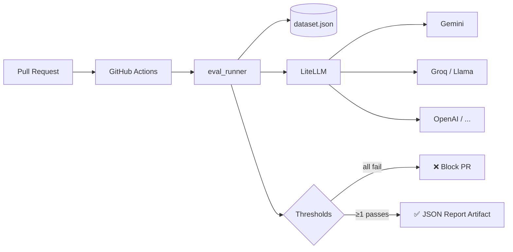

# LLM Reliability Benchmark Lab

[](https://github.com/KatsaounisThanasis/llm-reliability-lab/actions/workflows/evaluate.yml)


A CI/CD-ready evaluation harness that gates LLM regressions on **accuracy, latency, cost, and error rate** — Policy-as-Code for AI behavior.

When you change a prompt, swap a model, or tune parameters, this lab runs your eval dataset through one or more models and **fails the build** if any threshold is breached. No more silent regressions hitting users.

## Why

Production LLM applications regress silently:
- A prompt change drops accuracy from 95% to 70%.
- A "cheaper" model triples your monthly bill on long contexts.
- A new provider adds 4s p95 latency that no one notices until support tickets.

This lab treats LLM outputs as a **regression-testable surface**, the same way we treat APIs.

## What it does

- Runs prompts against one or more models via [LiteLLM](https://github.com/BerriAI/litellm) (Gemini, OpenAI, Groq, Anthropic, Ollama, …).
- Measures **latency, cost, accuracy, error rate** per model.
- Picks a winner across A/B configurations (accuracy → cost → latency).
- **Fails the GitHub Actions check** if every model misses the gates.
- Emits a versioned JSON regression report as a PR artifact.
- Retries transient errors (`RateLimitError`, `APIConnectionError`, `Timeout`) with exponential backoff + jitter.

## Architecture



## Quick start

```bash
python3 -m venv .venv
source .venv/bin/activate
pip install -r requirements.txt

# Single model
export GROQ_API_KEY="gsk_..."
python3 src/eval_runner.py --models "groq/llama-3.3-70b-versatile"

# A/B between two models
python3 src/eval_runner.py \
  --models "groq/llama-3.3-70b-versatile,groq/llama-3.1-8b-instant" \
  --accuracy-threshold 0.8 \
  --latency-threshold 3.0 \
  --cost-threshold 0.001 \
  --error-rate-threshold 0.0
```

## Sample output

```
Running evaluation with model=groq/llama-3.3-70b-versatile
------------------------------------------------------------------------
[1] latency=0.298s | cost=$0.000053 | accuracy=1 | expected='blue'
[2] latency=0.128s | cost=$0.000062 | accuracy=1 | expected='4'
[3] latency=0.116s | cost=$0.000059 | accuracy=1 | expected='devops'
[4] latency=0.126s | cost=$0.000067 | accuracy=1 | expected='8'
[5] latency=0.116s | cost=$0.000058 | accuracy=1 | expected='SRE_OK'
------------------------------------------------------------------------
Average Latency : 0.157s
Average Cost    : $0.000060
Average Accuracy: 1.000
Error Rate      : 0.000
Result          : PASSED

========================================================================
Winner: groq/llama-3.3-70b-versatile
PASSED: 2/2 model(s) passed thresholds.
```

A full machine-readable example is checked in at [`reports/sample_report.json`](reports/sample_report.json).

## CLI flags

| Flag | Env fallback | Default | Description |
|---|---|---|---|
| `--dataset` | `DATASET_PATH` | `data/dataset.json` | Dataset path |
| `--models` | `LITELLM_MODEL` | `gemini/gemini-2.5-flash` | Comma-separated model list |
| `--api-base` | `LITELLM_API_BASE` | — | LiteLLM API base override |
| `--api-key` | `LITELLM_API_KEY` → `GEMINI_API_KEY` → `OPENAI_API_KEY` | — | API key override |
| `--accuracy-threshold` | `ACCURACY_THRESHOLD` | `0.8` | Min average accuracy |
| `--latency-threshold` | `LATENCY_THRESHOLD` | `2.0` | Max average latency (s) |
| `--cost-threshold` | `COST_THRESHOLD` | `0.001` | Max average cost (USD) |
| `--error-rate-threshold` | `ERROR_RATE_THRESHOLD` | `0.0` | Max failed-request ratio |
| `--num-retries` | `NUM_RETRIES` | `3` | Retry count for transient API errors |
| `--report-dir` | `REPORT_DIR` | `reports/` | JSON report output directory |
| `--no-color` | — | — | Disable ANSI colored output |

## Dataset schema

```json
[
  {
    "prompt": "What is 2 + 2? Respond with one number only.",
    "expected": "4",
    "match_mode": "exact"
  },
  {
    "prompt": "Name a cloud provider.",
    "expected": "aws",
    "match_mode": "contains"
  }
]
```

- `prompt` — non-empty string.
- `expected` — non-empty string used for matching.
- `match_mode` — `"exact"` (default) or `"contains"`. Case-insensitive.

## CI/CD gate behavior

- The CI run **fails** only when **all** evaluated models breach thresholds.
- The CI run **passes** when **at least one** model satisfies every threshold.
- A timestamped JSON report is written under `reports/` and uploaded as a build artifact (14-day retention).

## How it works internally

1. `cli.resolve_config` merges CLI args > env vars > defaults into a typed `EvalConfig`.
2. `dataset.load_dataset` validates the JSON schema (rejects empty strings, unknown `match_mode`).
3. `runner.evaluate_model` runs each prompt through `litellm.completion`, wrapped in a Tenacity retry that targets only transient errors.
4. Errored requests are **excluded from latency/cost averages** to avoid metric pollution; they show up under `error_rate` instead.
5. `pick_winner` selects from passing models only — by accuracy, then cost, then latency. Returns `None` if all failed.
6. `report.write_report` emits a versioned JSON with thresholds, per-model summary, per-case detail, and `all_failed` flag.

## Project layout

```
src/
  cli.py             # argparse + env merge + Ansi factory
  cost.py            # cost extraction with safe fallback
  dataset.py         # schema validation
  entities.py        # frozen dataclasses (PromptCase, Thresholds, EvalConfig, ...)
  presentation.py    # terminal rendering (separated from compute)
  report.py          # JSON report writer
  runner.py          # core evaluation + Tenacity retry
  main.py            # orchestration
  eval_runner.py     # CLI entry point
tests/               # pytest unit tests with mocked completion()
.github/workflows/   # GitHub Actions evaluation gate
data/dataset.json    # sample dataset
reports/sample_report.json  # example A/B run output
```

## Tests

```bash
pytest -q
```

13+ unit tests covering dataset validation, CLI priority order, response extraction, error handling paths, and `match_mode` semantics.

## License

MIT — see [LICENSE](LICENSE).
